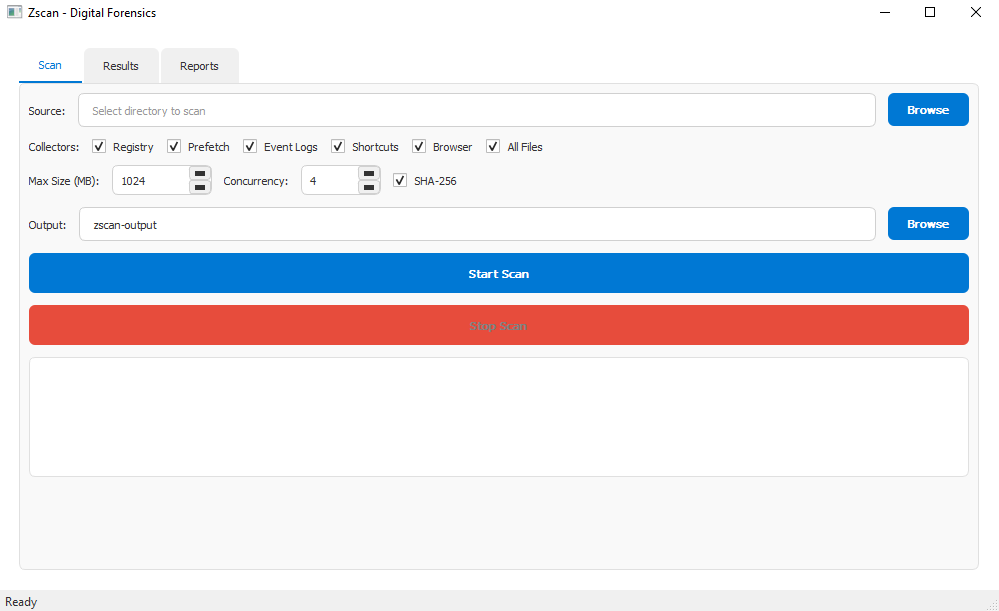
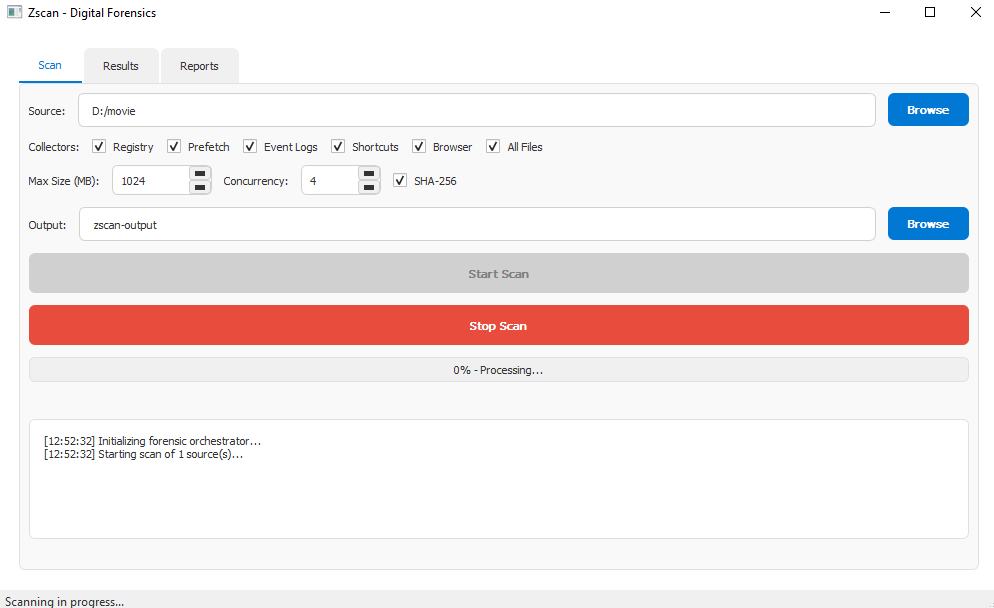
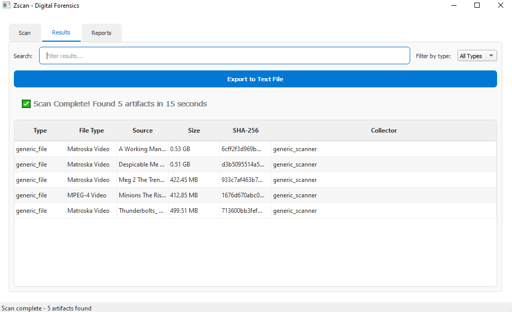
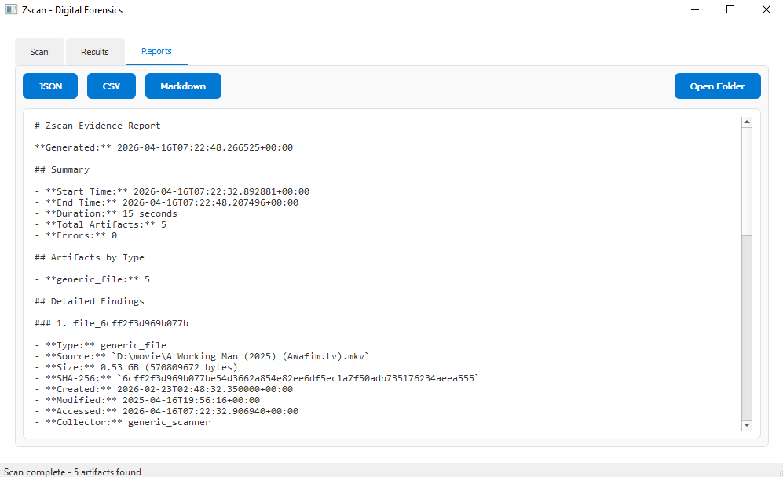

<h1 align="center">Zscan</h1>
<h3 align="center">Digital Forensics & Artifact Extraction Utility</h3>

<p align="center">
Zscan is a high-performance digital forensics tool designed for rapid artifact collection and system analysis. 
It streamlines the forensic process by automating the scanning of registries, event logs, and file system 
metadata into structured, actionable reports.
</p>

<p align="center">
  <a href="#overview">Overview</a> •
  <a href="#features">Features</a> •
  <a href="#tech-stack">Tech Stack</a> •
  <a href="#installation">Installation</a> •
  <a href="#screenshots">Screenshots</a> •
  <a href="#license">License</a>
</p>

---

<p align="center">
  
  
  
  
</p>

---

## Overview

Zscan is a professional forensic utility built to assist investigators in gathering critical system evidence quickly. It provides a clean, tabbed interface that guides the user from initial source selection through to detailed result filtering and multi-format report generation.

The application is optimized for speed, featuring multi-threaded concurrency and SHA-256 hashing to ensure data integrity during the extraction process.

---

## Features

- **Selective Artifact Collection**: Choose specific collectors including Registry, Prefetch, Event Logs, Shortcuts, and Browser data.
- **Advanced Scan Controls**: Configure maximum file size limits and thread concurrency for optimized performance.
- **Data Integrity**: Integrated SHA-256 hashing for all collected artifacts to ensure forensic validity.
- **Real-time Progress Tracking**: Live console output and progress bar during forensic orchestration.
- **Dynamic Result Filtering**: Search and filter through thousands of artifacts by type, source, or hash.
- **Multi-Format Export**: Generate forensic evidence reports in JSON, CSV, or Markdown formats.

---

## Tech Stack

### Core Technologies
<p align="left">
  
</p>

---

## Run on Localhost

```bash
python zscan_gui.py

```

## Screenshots

<details>
  <summary><strong>Click to expand screenshot gallery</strong></summary>

  <br>

  <p align="center">
    
  </p>
  <p align="center"><i>Dashboard UI</i></p>

  <p align="center">
    
  </p>
  <p align="center"><i>Root selection to scan</i></p>

  <p align="center">
    
  </p>
  <p align="center"><i>Extracted info</i></p>

  <p align="center">
    
  </p>
  <p align="center"><i>Professional report</i></p>

</details>

---

## License

This project is licensed under the MIT License.

---

<p align="center">
  Zscan Digital Forensic Tool
</p>

---
